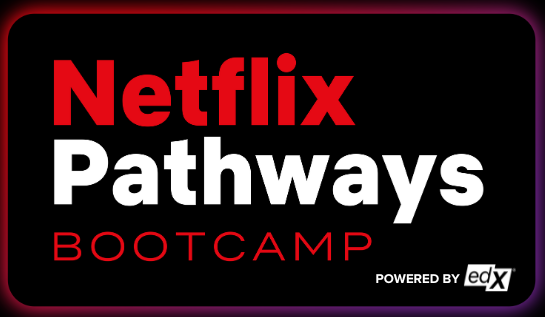

# Netflix Pathways Advanced Software Engineering Bootcamp

  

This repository showcases my journey and accomplishments during a rigorous Bootcamp. Throughout the program, I immersed myself in an intensive curriculum that was designed to equip me with essential programming skills and practical industry knowledge. 

Each Folder holds the different assignments I worked on throughout the program (M1 Challenge - M9 Challenge & Both Summative 1 and 2). 

The final project for this course is in its own Repository titled "Game-Store." (Link: https://github.com/JessieEstrada/Game-Store)
